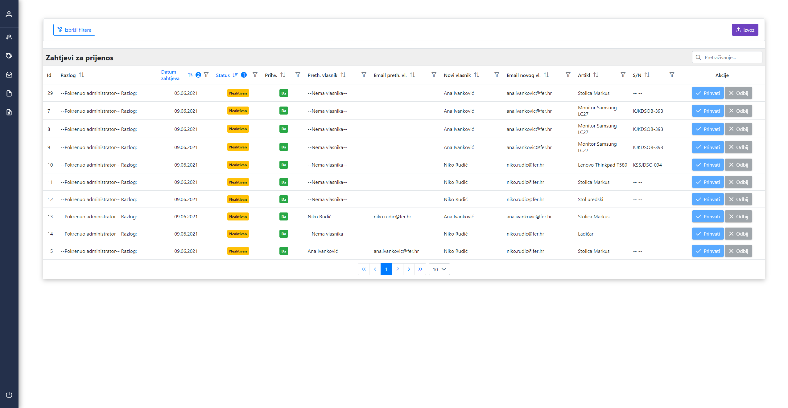

<h2 align="center">Office inventory tracking system</h2>

This project was built as my bachelor's final thesis. It's divided into 3 parts: Back-end written in Node.js with Express.js framework, web application for administrators written in Vue.js and mobile application for users written in React native with expo framework.

#### Why this project?

During my student work, I noticed a problem in the company with their inventory tracking lists. 
By law, in Croatia, all businesses are obligated to list all assets and their values upon establishment and update that list at least once a year. 
This creates a problem in company that is rapidly growing (such as those in ICT sector), so usual approach to this problem is making each employee in charge of certain items such as laptop, several monitors, office chair, table, printer, etc. that he uses.
Every year, an employee is obliged to confirm that he still owns all the items for which he is in charge.
At any time, an employee may write off an item for which he is in charge (eg. laptop in case of failure or due to age) by contacting the person in charge and signing a piece of paper to write off the item.
When a person leaves the company, he must transfer all his inventory to others and those items that he is unable to find needs to be repaid.
Over the years, lists that are tracked using paper or excel documents become disorganized and outdated, and over time a lot of non-existent objects are transferred to other people.

#### Suggested solution

An application that easily allows tracking, transferring and writing off items that an individual is in charge of by scanning QR codes that would be pasted on the item and simply scanned at the time needed (fallback of scanning QR codes is to manually write item's serial number). 
This prevents the transfer of non-existent items, the disappearance of write-off papers (impossibility to confirm that the item has been written off) and enables easier monitoring of the company's physical capital, which will not become inaccurate over time.

 
<h2 align="center">Screenshots </h2>
<!--screens start-->

  <h3 align="center">Web app for admins </h2>

The web app is intended only for admins. 

 

  
 
After login, admin is redirected to the user dashboard where he is able to see the list of all users in the system. Each table in this web app can be filtered and exported int .csv file.

   
   
The user can be deactivated, but only if he posses no items. If the user does posses items, they will need to be transferred to another user first. This can be done by user (in mobile app) or admin in "Artikli"(Items) dashboard where admin can filter items by user and then transfer them to another user (bach transfer is not implemented yet).

   
     
Admin can also change password for users if needed

   
     
All passwords need to follow certain rules to be strong enough in order for them to be valid. Passwords are hashed by Bycript hashing function and their hashes stored in DB. On login hashes are compared and httpOnly cookie (JWT) is received in the HTTP response and stored in browser.

   
       
If needed, admins can add new users.

   
       
Or edit some information on existing ones.

   
       
"Artikli" is dashboard where admin can see the whole inventory grouped by user with "--no owner--" items listed first. "No-owner" items appear by adding a new item (company can order few laptops and at first they won't have intended user). Written-off items have status "Otpisan" and they are the last on the list. 

   <a href="./Screenshots/Web/artikliSvi.PNG" target="_blank">
    <imgsrc="./Screenshots/Web/artikliSvi.PNG">
  </a>
 
Each column can be filtered by multiple queries in the same time. (eg "Starts with": "Lenovo" and "Contains": "Thinkpad" with additional filter on group column "IT Oprema(Equipment). Since there is limited data, this query will be quite simple

   
  
By applying query we are left with only 3 rows with owner that starts with "Niko". If needed, admin can add additional filter on other columns, but we won't apply it now.

   
 
In order to print QR codes for items you need to select items you want to print and then press on "QR kod" button in upper right corner.

   
  
Since QR codes are intended to be printed on pre-cut self adhesive sticker paper, you might want to adjust margins, sticker width/height, number of stickers per page or even to skip a few sticker places. This preview lets you do exactly that.

    
   
Similary to adding new users, admin can add new items.

     
 
Item can be written-off from some user by admin (or by the user himself in mobile app) - in which case there is already added note in "Reason field" stating: "--Initiated by admin-- Reason:.

  
  
Much like write-off items can be transferred from user to user by admin too.

   

Users write-off requests can be seen in "Zahtjevi za otpis" dashboard where admin can accept or decline the request.

     
 
Similary to write-offs there is also transfer dashboard

       

<h3 align="center">Mobile app for users </h2>

Mobile app is intended only for users. Admins can log in too, in that case, they use the app as normal user would (no extra features). 
There is no registration - app is intended for internal system so all accounts would be added by admins. 
After login, users can see their current assests and the last time each asset was scanned. Recently scanned items have a checkmark. 
By clicking on orange scan button, users can scan QR codes on the item and confirm they have the item in their possession.
At any time, users can request transfer or write-off of the items in their possession and wait for admin's approval. 
The status of each request can be monitored in the app.

  
  
   
   
    
     

  

<!--screens end-->

## Final thesis documentation

Available only in Croatian - [ZavrsniDokumentacija.pdf](https://github.com/NRudic/OfficeInventoryTrackingSystem/blob/main/ZavrsniDokumentacija.pdf)

## License

[MIT](https://opensource.org/licenses/MIT)
